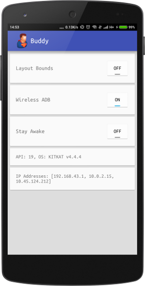

Buddy - a developer's friend! :)

Enables wireless debugging

Keeps screen awake when plugged in

Exposes layout bounds

Displays IP addresses and OS information

[Download](https://github.com/androidfanatic/Buddy/releases/download/1.0/app-release.apk)

How to connect to ADB over WiFi?

Enable WiFi adb.

Make sure phone and computer are on the same network

Note various IP addresses listed in the app.

Execute this command on computer's terminal: adb connect <IP Address>:5555 to connect to adb over WiFi.
